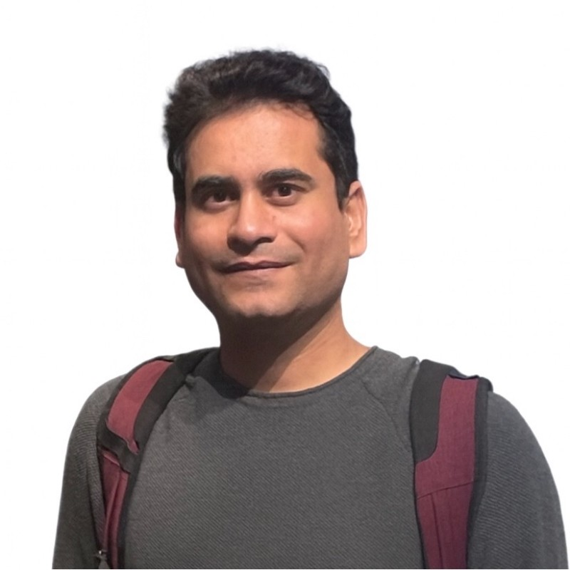

::: {.content-body}

I'm a Senior Scientist at the Geological Survey of Finland (GTK). My work spans magnetotelluric geophysics, inverse theory, uncertainty quantification, scientific machine learning (utilizing the best of both domain knowledge and machine learning), and multiphysics data integration, with an emphasis on inversion methods that combine diverse geophysical and geoscientific data, treat uncertainty explicitly, and accelerate forward solvers while keeping the physics intact. You're welcome to browse my projects, publications, and research interests. If something catches your attention, feel free to <strong>[\[<i class="bi bi-envelope"></i>\]](mailto:pankajkmishra01@gmail.com)</strong> to discuss possible collaborations.

## Work

- 💼 **05/2023 – Present** | Senior Scientist, Geophysical Solutions, Geological Survey of Finland
- 💼 **06/2021 – 05/2023** | Research Scientist, Geological Survey of Finland
- 💼 **06/2019 – 05/2021** | Postdoc, UTIG, The University of Texas at Austin, USA
- 💼 **08/2017 – 05/2019** | Postdoc, Department of Mathematics, HKBU, Hong Kong
- 🎓 **01/2018** | PhD, Indian Institute of Technology Kharagpur, India
- 🎓 **06/2012** | Masters in Geophysics, Indian Institute of Technology Kharagpur, India
- 🎓 **06/2009** | Bachelors in Physics & Mathematics, DDU Gorakhpur University, India

## Science communication

[Earth Twin Needs Geoscience](https://geoscientist.online/sections/viewpoint/earth-twin-needs-geoscience/) — **Pankaj K Mishra**, *Geoscientist* 35(4), 2025.

::: {.section-spacer}
:::

::: {.dash-list-wrap}
- **Aug 10–15, 2026** | I will be at [JuliaCon 2026](https://juliacon.org/2026/) in Germany.
- **Aug 1–8, 2026** | I will attend [EMIW 2026](https://www.emiw.org/) in St. John's, Newfoundland and Labrador, Canada.
- **Jul 2–8, 2026** | I was at the [EGU General Assembly 2026](https://www.egu26.eu/) in Vienna, Austria.
- **Jan 12–16, 2026** | I will attend the [Nordic Winter Geological Meeting](https://ngwm2026.fi/) in Helsinki, Finland.
:::

:::
