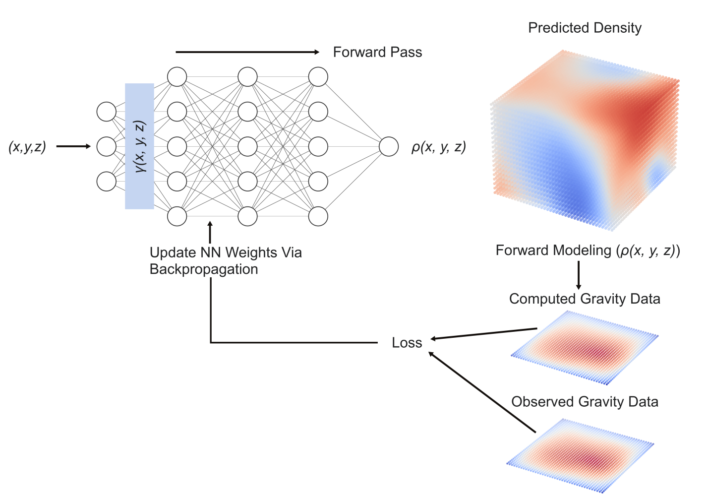
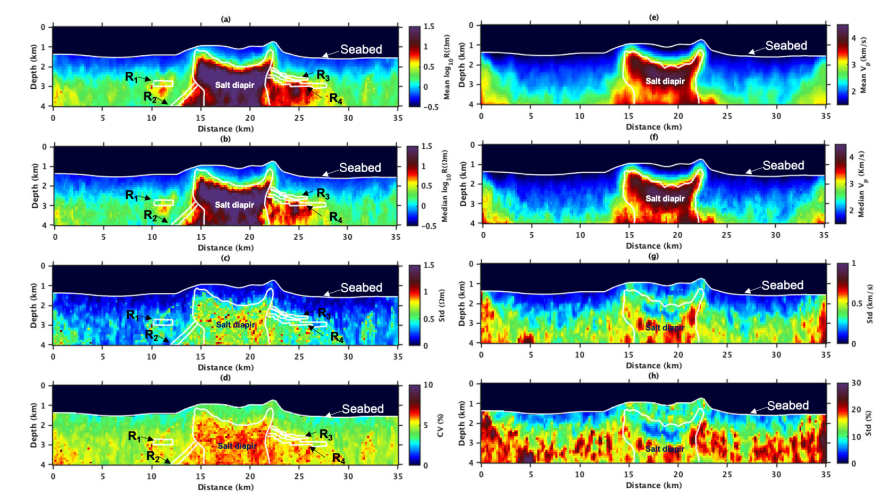
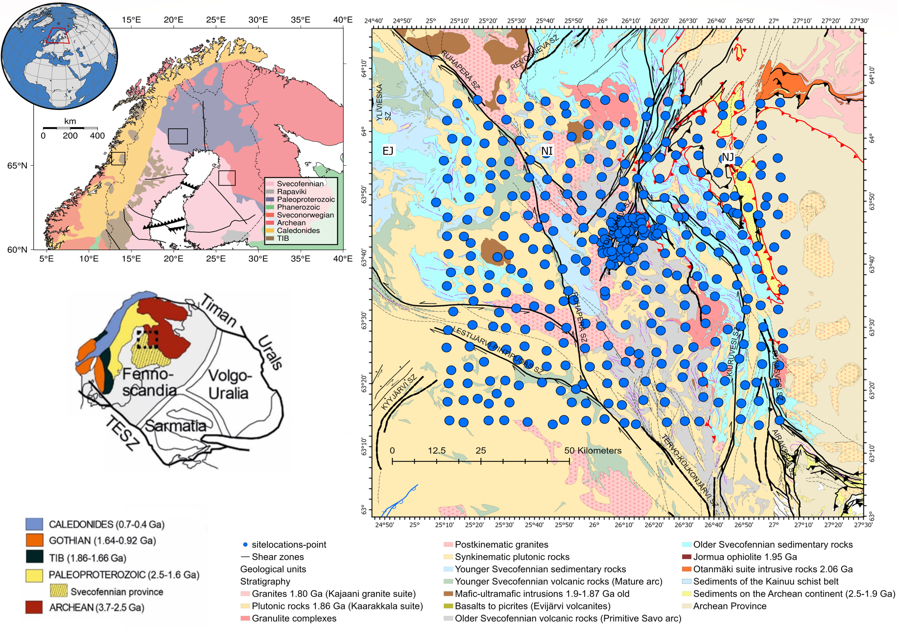
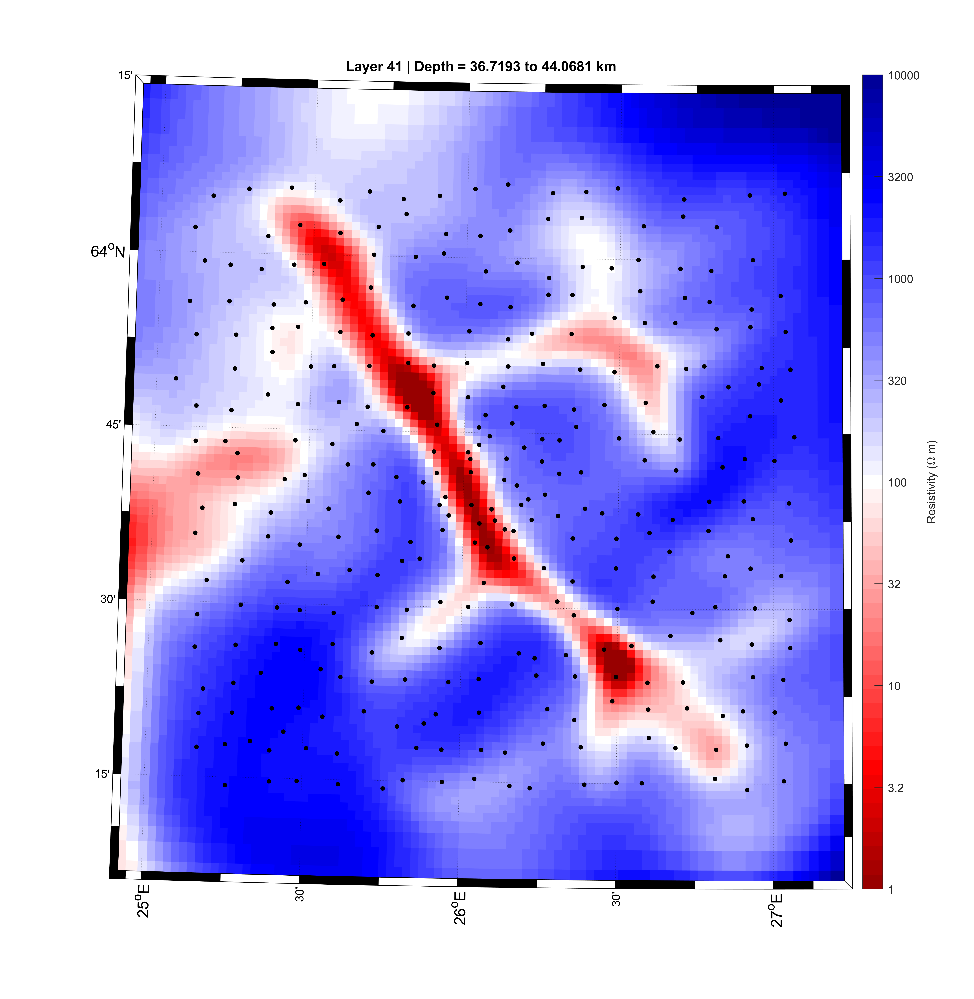

::: {.content-body}

## Physics-based machine learning for geophysical inversion

{.research-figure .research-figure--narrow fig-alt="INR figure"}

{.research-figure fig-alt="INR animation"}

<hr/>

## Stochastic inversion, uncertainty estimation and joint-inversion

```{=html}
<video autoplay loop muted playsinline style="max-width:100%; display:block; margin:0 auto;">
  <source src="videos/multiverse.mp4" type="video/mp4">
  Your browser does not support the video tag.
</video>
```

[{.research-figure}](https://onlinelibrary.wiley.com/doi/10.1111/1365-2478.70043)

<hr/>

## Large-scale 3D magnetotelluric modelling & inversion

[{.research-figure}](https://mt.research.ltu.se/web/home)

**D-Rex**, funded by ERA-MIN2 under Horizon 2020, has concluded its work and is now in the reporting phase. The project advanced the understanding of mineral systems through geophysical data from Sweden, Norway, and Finland, integrating it into a unified Common Earth Model (CEM). Key efforts included electromagnetic surveys, 3D modeling, and machine learning techniques. Although we do not search for mineral deposits in this project, the outcomes are expected to improve Europe's raw material self-sufficiency by enhancing geological models and enabling the discovery of new, higher-grade mineral deposits.

[{.research-figure}](https://mt.research.ltu.se/web/home)

:::
